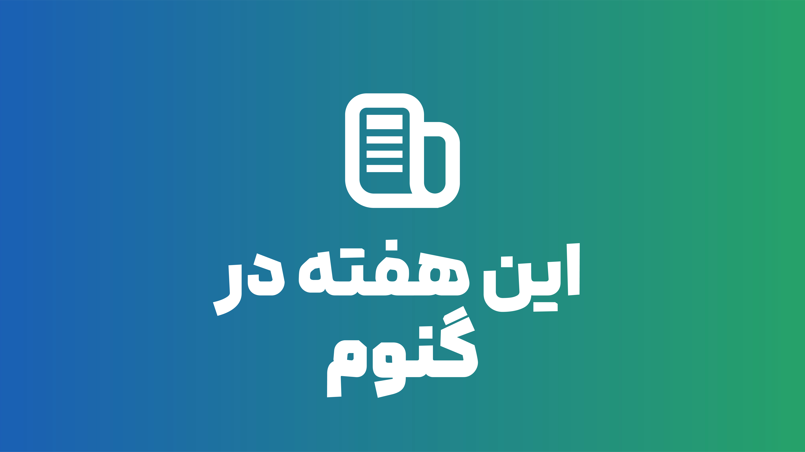

# "This Week in GNOME" podcast in Farsi!

This is an archive for podcast episodes 🎙️, show notes 📝, and branding assets 🎨.

## Episodes 🎧

Each podcast episode is located in its own directory under `episodes/`. Each episode folder contains:

*   `audio.ogg` or `[audio-file-name].ogg`: The podcast audio file.
*   `notes.md`: The notes and script that I read during the podcast.

You can find the list of episodes in the [episodes/](episodes/) directory.

## Branding ✨

Graphics files for the "This Week in GNOME - Farsi Edition" logo and banner are available in the [branding/](branding/) directory.

## How to Listen 📢

You can download the audio files directly from this repository.